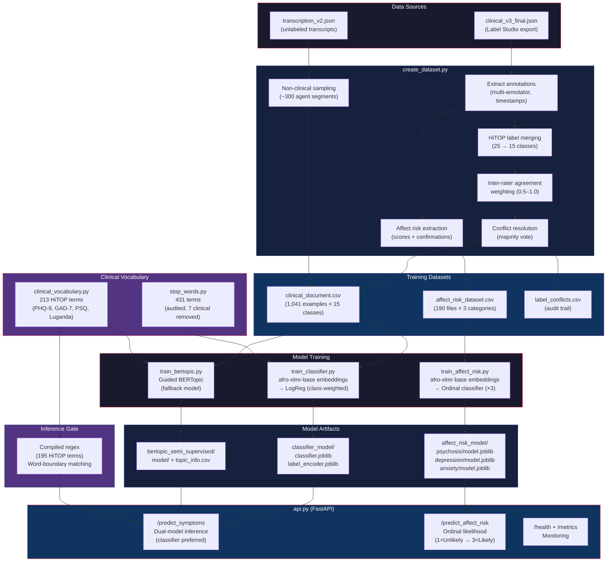
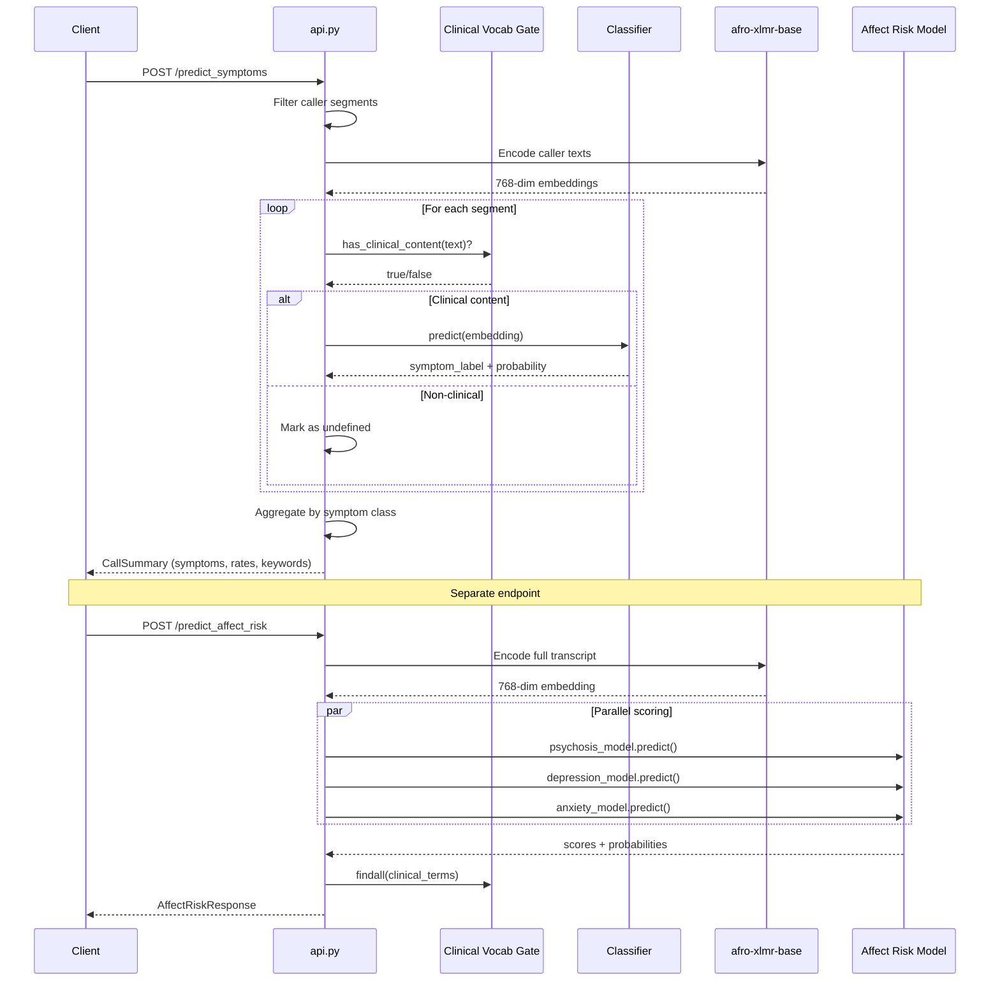
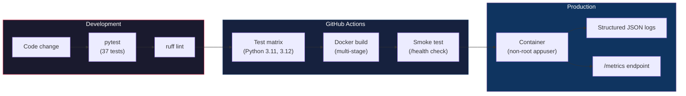

# MHDP Data Pipeline

## End-to-End Pipeline

```mermaid
flowchart TD
    subgraph DATA["Data Sources"]
        A1["clinical_v3_final.json<br/>(Label Studio export)"]
        A2["transcription_v2.json<br/>(unlabeled transcripts)"]
    end

    subgraph PREP["create_dataset.py"]
        B1["Extract annotations<br/>(multi-annotator, timestamps)"]
        B2["HiTOP label merging<br/>(25 → 15 classes)"]
        B3["Inter-rater agreement<br/>weighting (0.5–1.0)"]
        B4["Conflict resolution<br/>(majority vote)"]
        B5["Non-clinical sampling<br/>(~300 agent segments)"]
        B6["Affect risk extraction<br/>(scores + confirmations)"]
    end

    subgraph ARTIFACTS["Training Datasets"]
        C1["clinical_document.csv<br/>(1,041 examples × 15 classes)"]
        C2["affect_risk_dataset.csv<br/>(190 files × 3 categories)"]
        C3["label_conflicts.csv<br/>(audit trail)"]
    end

    subgraph TRAIN["Model Training"]
        D1["train_classifier.py<br/>afro-xlmr-base embeddings<br/>→ LogReg (class-weighted)"]
        D2["train_affect_risk.py<br/>afro-xlmr-base embeddings<br/>→ Ordinal classifier (×3)"]
        D3["train_bertopic.py<br/>Guided BERTopic<br/>(fallback model)"]
    end

    subgraph MODELS["Model Artifacts"]
        E1["classifier_model/<br/>classifier.joblib<br/>label_encoder.joblib"]
        E2["affect_risk_model/<br/>psychosis/model.joblib<br/>depression/model.joblib<br/>anxiety/model.joblib"]
        E3["bertopic_semi_supervised/<br/>model/ + topic_info.csv"]
    end

    subgraph VOCAB["Clinical Vocabulary"]
        F1["clinical_vocabulary.py<br/>213 HiTOP terms<br/>(PHQ-9, GAD-7, PSQ, Luganda)"]
        F2["stop_words.py<br/>431 terms<br/>(audited, 7 clinical removed)"]
    end

    subgraph API["api.py (FastAPI)"]
        G1["/predict_symptoms<br/>Dual-model inference<br/>(classifier preferred)"]
        G2["/predict_affect_risk<br/>Ordinal likelihood<br/>(1=Unlikely → 3=Likely)"]
        G3["/health + /metrics<br/>Monitoring"]
    end

    subgraph GATE["Inference Gate"]
        H1["Compiled regex<br/>(195 HiTOP terms)<br/>Word-boundary matching"]
    end

    A1 --> B1
    A2 --> B5
    B1 --> B2
    B2 --> B3
    B3 --> B4
    B4 --> C1
    B5 --> C1
    B1 --> B6
    B6 --> C2
    B4 --> C3

    C1 --> D1
    C1 --> D3
    C2 --> D2

    D1 --> E1
    D2 --> E2
    D3 --> E3

    F1 --> D3
    F1 --> H1
    F2 --> D1

    E1 --> G1
    E3 --> G1
    E2 --> G2
    H1 --> G1

    style DATA fill:#1a1a2e,stroke:#e94560,color:#fff
    style PREP fill:#16213e,stroke:#0f3460,color:#fff
    style ARTIFACTS fill:#0f3460,stroke:#533483,color:#fff
    style TRAIN fill:#1a1a2e,stroke:#e94560,color:#fff
    style MODELS fill:#16213e,stroke:#0f3460,color:#fff
    style VOCAB fill:#533483,stroke:#e94560,color:#fff
    style API fill:#0f3460,stroke:#e94560,color:#fff
    style GATE fill:#533483,stroke:#0f3460,color:#fff
```

## Inference Flow (Single Request)

```mermaid
sequenceDiagram
    participant Client
    participant API as api.py
    participant Gate as Clinical Vocab Gate
    participant Clf as Classifier
    participant Emb as afro-xlmr-base
    participant Risk as Affect Risk Model

    Client->>API: POST /predict_symptoms
    API->>API: Filter caller segments
    API->>Emb: Encode caller texts
    Emb-->>API: 768-dim embeddings

    loop For each segment
        API->>Gate: has_clinical_content(text)?
        Gate-->>API: true/false
        alt Clinical content
            API->>Clf: predict(embedding)
            Clf-->>API: symptom_label + probability
        else Non-clinical
            API->>API: Mark as undefined
        end
    end

    API->>API: Aggregate by symptom class
    API-->>Client: CallSummary (symptoms, rates, keywords)

    Note over Client,Risk: Separate endpoint

    Client->>API: POST /predict_affect_risk
    API->>Emb: Encode full transcript
    Emb-->>API: 768-dim embedding

    par Parallel scoring
        API->>Risk: psychosis_model.predict()
        API->>Risk: depression_model.predict()
        API->>Risk: anxiety_model.predict()
    end
    Risk-->>API: scores + probabilities
    API->>Gate: findall(clinical_terms)
    API-->>Client: AffectRiskResponse
```

## Deployment Pipeline

```mermaid
flowchart LR
    subgraph DEV["Development"]
        A["Code change"]
        B["pytest<br/>(37 tests)"]
        C["ruff lint"]
    end

    subgraph CI["GitHub Actions"]
        D["Test matrix<br/>(Python 3.11, 3.12)"]
        E["Docker build<br/>(multi-stage)"]
        F["Smoke test<br/>(/health check)"]
    end

    subgraph PROD["Production"]
        G["Container<br/>(non-root appuser)"]
        H["Structured JSON logs"]
        I["/metrics endpoint"]
    end

    A --> B
    B --> C
    C --> D
    D --> E
    E --> F
    F --> G
    G --> H
    G --> I

    style DEV fill:#1a1a2e,stroke:#e94560,color:#fff
    style CI fill:#16213e,stroke:#0f3460,color:#fff
    style PROD fill:#0f3460,stroke:#533483,color:#fff
```
